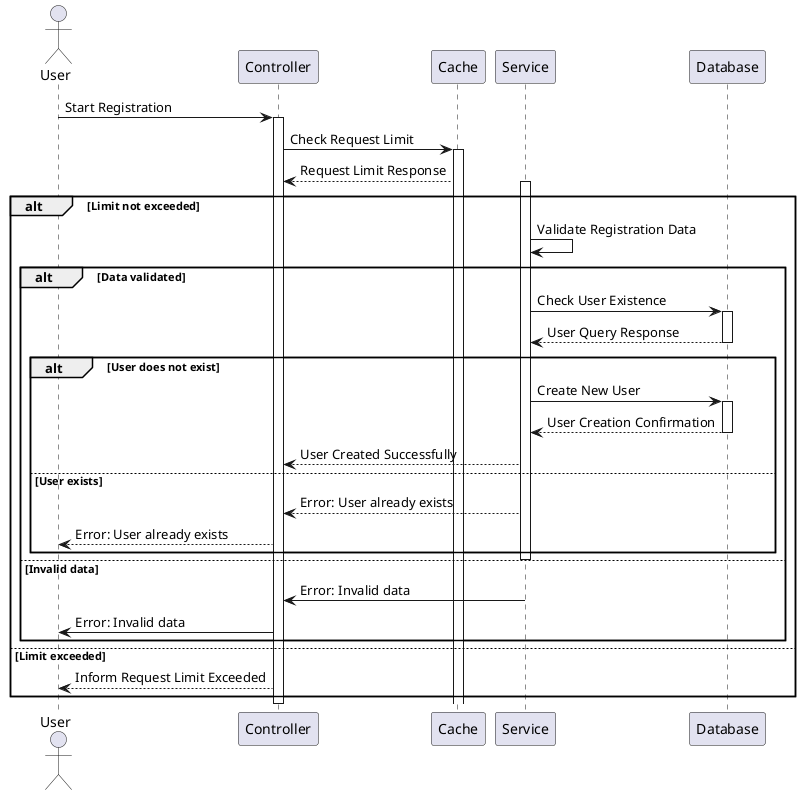

```plantuml
@startuml
actor User as User
participant "Controller" as Controller
participant "Cache" as Cache
participant "Service" as Service
participant "Database" as DB

User -> Controller: Start Registration
activate Controller
Controller -> Cache: Check Request Limit
activate Cache
Cache --> Controller: Request Limit Response
alt Limit not exceeded
    activate Service
    Service -> Service: Validate Registration Data
    alt Data validated
      Service -> DB: Check User Existence
      activate DB
      DB --> Service: User Query Response
      deactivate DB
      alt User does not exist
          Service -> DB: Create New User
          activate DB
          DB --> Service: User Creation Confirmation
          deactivate DB
          Service --> Controller: User Created Successfully
      else User exists
          Service --> Controller: Error: User already exists
          Controller --> User: Error: User already exists
      end
      deactivate Service
    else Invalid data
      Service -> Controller: Error: Invalid data
      Controller -> User: Error: Invalid data
    end
else Limit exceeded
    Controller --> User: Inform Request Limit Exceeded
end
deactivate Controller
@enduml
```