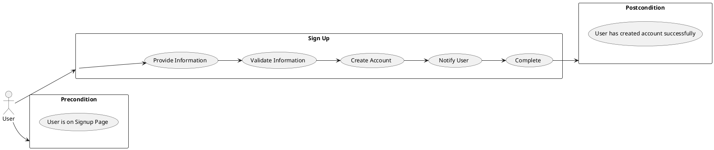

```plantuml
@startuml
left to right direction
actor User as User
rectangle "Sign Up" {
  User --> (Sign Up)
  (Sign Up) --> (Provide Information)
  (Provide Information) --> (Validate Information)
  (Validate Information) --> (Create Account)
  (Create Account) --> (Notify User)
  (Notify User) --> (Complete)
}

rectangle "Precondition" {
  (User is on Signup Page)
}

rectangle "Postcondition" {
  (User has created account successfully)
}

(User) --> (Precondition)
(Complete) --> (Postcondition)
@enduml
```

```plantuml
@startuml
left to right direction
actor User as User
```